# IXSwap Economics stress-testing
- <a href="">Trading Activity</a> (to be added)
- <a href="https://github.com/IX-Swap/models-testing/tree/amm">AMM prototype and simulations</a>

# Introduction

Current repository contains two parts: traders activity simulation models with transaction histories and AMM market simulation. Current readme will cover general description of both parts in detail, referring to the inner project structure, code fragments and explaining some solutions closely. Each project part has its own branch and each branch will have a local readme file only about the part where it is inserted.

Current project contains Uniswap V2 pools transaction histories analysis shown in the PDF document ```IXS_pools_analysis_v1.pdf```. This readme explains implementation of the simulations and used/created algorithms conform next structure:

* [Traders activity simulations and structure](#traders-activity-simulations-and-structure):
  * [General description of the project structure](#general-description-of-the-project-structure)
  * [Monte Carlo simulations](#monte-carlo-simulations):
    * [Normal distribution generator](#normal-distribution-generator)
    * [Log-Normal distribution generator](#log-normal-distribution-generator)
    * [Pareto distribution generator](#pareto-distribution-generator)
    * [Cauchy distribution generator](#cauchy-distribution-generator)
    * [Gamma distribution generator](#gamma-distribution-generator)
    * [Weibull distribution generator](#weibull-distribution-generator)
    * [Monte Carlo transaction simulator](#monte-carlo-transaction-simulator)
    * [Simulations with best match to the real life distributions](#simulations-that-have-the-best-match-with-real-life-distributions)
    * [Parameter search algorithms](#parameter-search-algorithms)
  * [Transaction history](#transaction-history):
    * [Analysis strategy and performed data manupulations](#analysis-strategy-and-performed-data-manipulations)
    * [MEV attack](#mev-attack)
    * [How use of stablecoins in token pairs stabilizes distributions](#how-use-of-stablecoins-in-token-pairs-stabilizes-distributions)
* [MEV attacks analysis](#mev-attacks-analysis)
  * [Used code for performing analysis](#used-code-for-performing-analysis)
    * [Libraries](#libraries)
    * [Etherscan scrapper](#etherscan-scrapper)
    * [Pools simulations analysis and basic MEV attacks analysis Jupyter notebooks](#pools-simulations-analysis-and-basic-mev-attacks-analysis-jupyter-notebooks)
    * [MEV attacks analysis by their frequency, profits, gas spendings](#mev-attacks-analysis-by-their-frequency-profits-gas-spendings)
* [What's next?](#whats-next)

# Traders activity simulations and structure

## General description of the project structure

Current project part contains realization of the traders activity simulations using specific mathematical distribution models and traders activity histories with both scripts collecting transactions of different categories for specified pools and analysis of those transactions histories for each pool. All files in the project were separated into packages and libraries conform to their role in the project. One of the main packages is the ```lib``` one, containing ```.py``` files with the most important classes in the project:

* ```monte_carlo.py``` - file with realization of Monte-Carlo simulation classes:
  * ```Transaction``` class - allows simulating swap-based transactions on the AMM market;
  * ```PoissonGenerator``` class - responsible for defining amount of transaction happening per minute using Poisson distribution probability principle;
  * ```NormalGenerator``` class - sets transaction values randomly conform normal distribution;
  * ```LogNormalGenerator``` class - sets transaction values randomly conform log-normal distribution;
  * ```CauchyGenerator``` class - sets transaction values randomly conform Cauchy distribution;
  * ```ParetoGenerator``` class - sets transaction values randomly conform Pareto distribution;
  * ```MonteCarloTransactionsSimulator``` class - responsible for creating required transaction history using specific (chosen) transaction values generator;
  * ```LogNormalParameterSearcher``` class - picks best parameters to make log-normal distribution look as close as possible to the given distribution;
  * ```CauchyParameterSearcher``` class - picks best parameters to make Cauchy distribution look as close as possible to the given distribution.
* ```uniswap_v2_extractor.py``` - file with realization of classes used to extract transaction histories for specified contracts from Uniswap V2:
  * ```get_pool_v2_reserves_history``` extracts list of reserve updates, ```list_to_reserves_dictionary``` changes data type of reserves update record data from list to dictionary which be further inserted into Pandas DataFrame, ```pool_reserves_to_df``` performs transformation of list of lists reserves updates into reserves history Pandas DataFrame;
  * ```get_pool_v2_history``` extracts swap-transactions history from Uniswap V2. ```list_to_transaction_dictionary``` transforms swap-transaction data from list into dictionary, ```pool_history_to_df``` performs swap-transaction history from list of lists form into Pandas DataFrame;
  * ```get_pool_v2_mints``` and ```get_pool_v2_burns``` extract list of burns and mints histories in lists form, ```list_to_mints_dictionary``` changes each burn or mint record from list to the dictionary form, ```pool_mints_to_df``` and ```pool_burns_to_df``` transform burns or mints histories for lists of lists into Pandas DataFrames;
  * ```filter_swaps``` extract direct swaps and other ones (like “flash” ones), separating them.
* ```uniswap_v2_plots.py``` - file containing plots functions:
  * ```show_swaps_count_moving_averages``` - show moving daily average and one week rolling average line plots for swaps operations count;
  * ```show_swaps_reserves_evolution_through_time``` - show reserves changes line plots through time for specified pool;
  * ```show_pool_price_evolution_from_reserves``` - show reserve-based token prices line plots through time;
  * ```show_swaps_amount_in_moving_averages``` - show swaps activity capitalization (counted respective to tokens) for one day and week rolling average through time;
* ```transaction_history_v3_tools.py``` - file containing class used to work with transaction histories taken from Uniswap V3. Class contains some specific big methods to work with V3 histories:
  * ```classify_history``` separate transaction history conform their properties (swaps, mints, burns, anomalies);
  * ```form_moving_averages_for_token``` creates distributions one day average and one week rolling average for each transaction type for specified token;
  * ```lineplots_matrix``` shows matrix of line plots charts;
  * ```histplots_matrix``` shows matrix of histograms charts;
  * ```show_transactions_frequencies_per_minute``` prints transaction frequency for each transaction type per minute;
  * ```show_min_max_values_by_token``` prints minimal and maximal values for each transaction type;
  * ```lineplots_moving_averages_matrix_by_token``` shows line plots moving averages by token matrix.

Other packages mostly contain Jupyter Notebooks dedicated to collecting, reviewing and analysing the data required for this project implementation. Considering that below are presented short descriptions for each package and each notebook presented in the project:

* ```monte_carlo_generator``` package contains one Jupyter Notebook named ```Monte_carlo_versions``` dedicated to different implementations of the Monte-Carlo algorithms and how they can be used, how to work with them;
* ```web_scrapper``` package contains all files related to collecting the data of insiders trades for shares. ```chromedriver.exe``` is a web-driver required for collecting the data from the Yahoo Finance web-page containing insiders trades history using Selenium framework. ```web_scrapper.py``` contains code required for scrapping the data out of the web-page. ```web_shares_scraping``` Jupyter Notebook contains scripts collecting the data;
* ```shares_insiders_history``` is a package containing the data about insiders trades and Jupyter Notebook ```fast_shares_analysis``` with small analysis of the Yahoo Finance insiders shares trades;
* ```pools_history``` contains first drafts of the Monte-Carlo simulations and their prototypes, scripts for collecting Uniswap V3 pools data and their analysis;
* ```uniswap_v2_pools_analysis``` package contains ```uniswap_USDC-ETH_v2``` Jupyter Notebook that contains work for collecting and analysing the data from Uniswap V2, basing on which was performed next collection and analysis of the data, ```v2_pools_analysis``` contains first Uniswap V2 pools extractions with examples of fitting Monte-Carlo simulations to be close to the real Uniswap V2 histories
* ```real_v2_pools_stories``` package contains all performed Uniswap V2 pools history analysis with different versions of the history extraction. For analysis, different token pairs containing altcoins, stablecoins, NFTs, STOs, meme-tokens.

The next part covers more detailed code description, its most important moments and general aspects of work.

## Monte-Carlo simulations

This chapter will be described with the next structure:

* Transaction frequency or Poisson distribution;
* Transaction value generators:
* Pareto distribution
* Normal distribution
* Log-normal distribution
* Cauchy distribution
* Value generator that has the best correlation with the real data
* Parameters searchers for picking the best parameters for the best value generators

### Transaction frequency generator or Poisson generator

The first problem that appeared during implementation of the transaction history simulation was the fact that there is some average transaction frequency per specified time interval, but transaction count per specified time interval is unstable, meaning that different time periods have different amounts of transactions happening. Another moment is that transactions are happening in different positions on the specified time intervals. To solve those problems it was decided to use Poisson distribution generators.

Poisson distribution is a discrete probability distribution that expresses the probability of a given number of events happening in fixed time intervals with a constant mean rate and independently from the last event time (it can also be applied to other metrics like distance). The formula for the Poisson Distribution is:

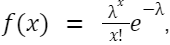

where *e* is representing Euler’s number, *x* represents the number of event occurrences, *lambda* is equal to the expected value of *x* also equal to its variance. 

```NumPy``` library contains a ```random``` module with method ```poisson``` which creates values that conform to Poisson distribution based on the transmitted parameters. It generates the amount of transactions that happen during a specific time interval, but it is required to specify transaction timestamps. This moment is solved by applying random timedelta to the given time interval starting timestamp for each transaction separately. 

### Normal distribution generator

Normal distribution is also a normal probability distribution for a real-valued random variable that contains next formula:

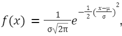

where *mu* is the mean or expectation of the distribution, *sigma* is the standard deviation, *e* is Euler’s constant. Probability density function of this distribution is also noted as *ф(x)*. Normal distribution looks like chart presented below:

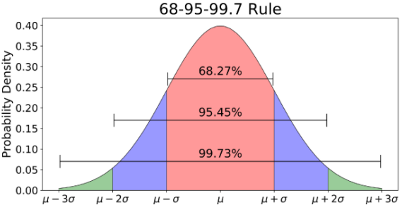

The only problem of this distribution is that there is a possibility of producing negative values that should not be present in the transaction values. The only way to evade negative values production is use of the truncated normal distribution conform next formula:

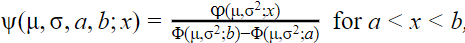

In this formula *ф(x)* represents a probability density function of the "parent" general normal distribution with mean, variance, truncation interval represented by *a* and *b*. There is one more symbol requiring explanation - the *Ф* one. Imagine a situation where is needed to determine the probability that a distribution will generate a value less than a specified value of *x*. The calculation of this probability will be according to the following function:

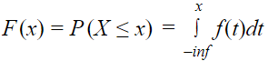

```Scipy.stats``` module contains a function called ```truncnorm``` dedicated to generating truncated normal distribution conform specified values interval. This function works with ```mu``` parameter representing mean distribution value, ```sigma``` representing standard deviation of the distribution, ```lower bound``` and ```upper bound``` representing values interval. Values are generated with next call:

```python
return truncnorm.rvs((self.lower_bound - self.mu)/self.sigma, (self.upper_bound - self.mu)/self.sigma, loc=self.mu, scale=self.sigma, size=transactions_count)
```

### Log-normal distribution generator

Log normal distribution is the probability distribution of a random variable whose logarithm is normally distributed. Conform this distribution generated value x can be described by the formula:

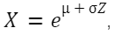

where *Z* is a standard normal variable, *mu* represents distribution mean and *sigma* - standard deviation. Considering that traders' activity has extreme rises and drops it is required to consider such a case, which is covered by this type of distribution.

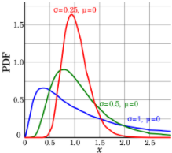

```numpy.random``` module contains ```lognormal``` function used for generating values conforming to Log-Normal probability distribution working by a similar principle as previous methods of sigma and mu parameters.

### Pareto distribution generator
	
Pareto distribution is the power-law probability distribution that is used in description of social, quality control, scientific, and other types of phenomenons. The base principle behind this distribution is the “80 to 20” rule that describes distribution of wealth in society and therefore this distribution should cover better traders' activity simulation tasks. The probability distribution function is:

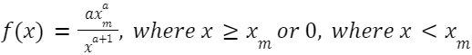

where *x_m* is a minimal possible value of *X* (also called as ```scale``` parameter) and shape parameter *a*.

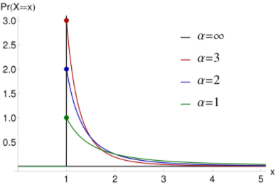

```numpy.random``` module has a function called ```pareto``` that is responsible for generating the Pareto distribution.

### Cauchy distribution generator

Cauchy distribution is a probability distribution of the x-intercept of a ray issuing from (x0, ) with a uniformly distributed angle. Formula:

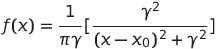

where *x0* is locational parameter setting location of the distribution peak and *mu* is the scale parameter which specifies the half-width and half-maximum.

```scipy.stats.halfcauchy``` module contains the ```rvs``` function which is responsible for generating values conforming to the Cauchy distribution without negative values, meaning that generated values will match real transactions values.

There is still one problem remaining about Cauchy - it is able to give unrealistically big transaction values, meaning that there is a small chance that there will appear anomalous value which is not corresponding to the real world case. This problem was solved via “mapping” values mechanism, graphical representation of which can be understood from given example:

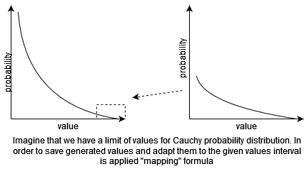

“Mapping” formula:

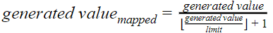

where the *generated value* is representing the original Cauchy generated value, the *limit* demonstrates the upper bound of the possible values. Such an algorithm allows keeping the original Cauchy distribution almost unchanged (without breaking the probabilities) and producing values only of specific limit.

```python
return value / ((value // self.limit) + 1)
```

### Gamma distribution generator

Gamma distribution is represents two-parametric distribution which is used in describing system degradation, obsolescence and failure. Distribution is controlled via changing lambda and alpha parameters. Distribution is described by the next formula:

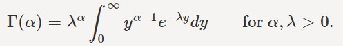

Distribution looks like exponential one and change of values cause next distribution of values:

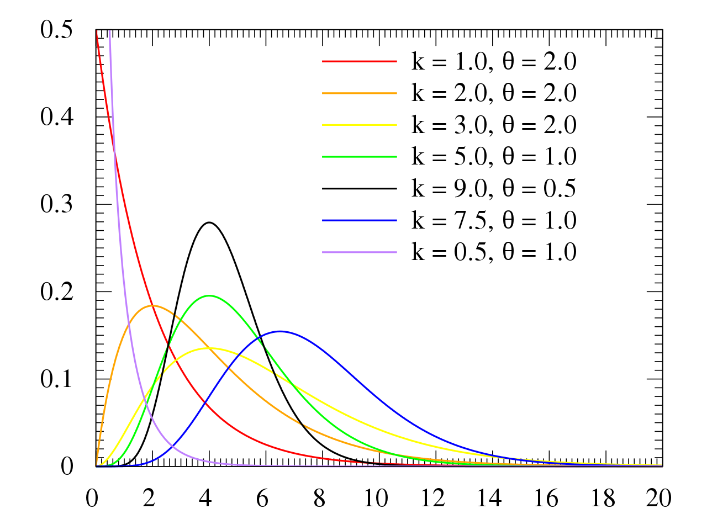

Considering that most of the transactions are performed with lower values and their distribution looks like exponential one, this distribution may be used for performing trades generation and it is possible that it will perform great in solving simulation problems.

**Scipy** contains method ```scipy.stats.gamma``` is used for generating values conform gamma distribution. The probability density standardized function is present in form:

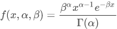,

where *Г(a)* is a gamma function shown above and takes *a* is shape parameter. *a* equal to integer value reduces to Erlang distribution, where *a = 1* reduces to the exponential function.

### WeiBull distribution generator

Concept behind Weibull distribution is similar to the case of Gamma function and describes failure rate considering wearout and burning failures. From the first look this concept does not look like applicable for the current simulations, but it is important to mention that it performs as an exponential function similar to gamma one, but more changeable and adaptive to changed parameters. Weibull is controlled via scale and shape parameters. Correct use of those parameters is able to make distribution similar to the transaction values probability density function.

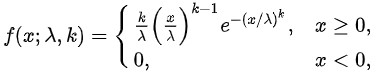

Distributions look similar to reviewed transaction values distributions and tuneability of this distribution is relatively easy.

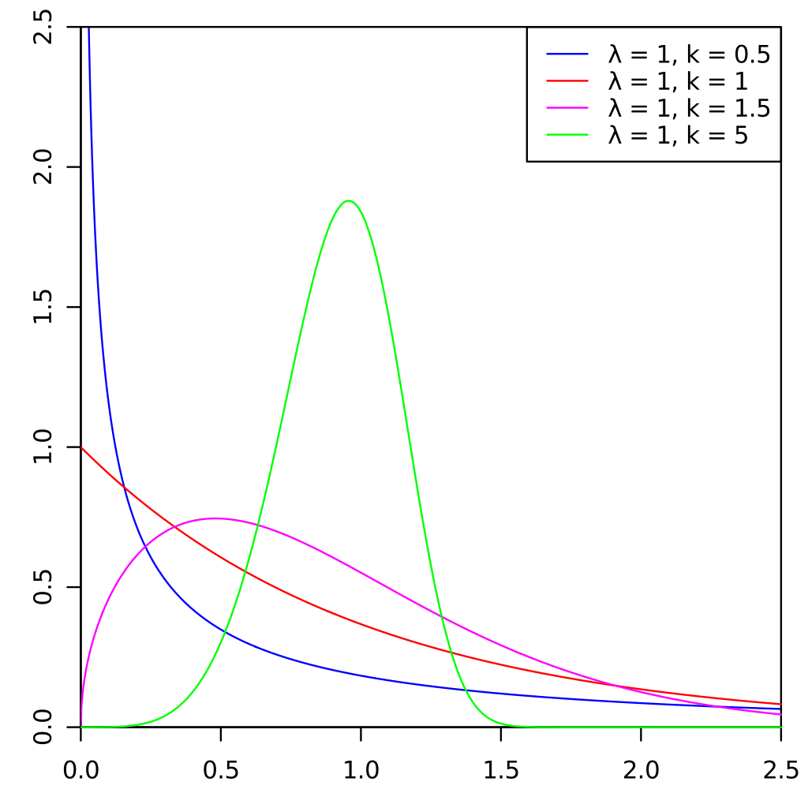

**Numpy** library contains method required for generating values conform WeiBull distribution. ```numpy.random.weibull``` contains several implementations of Weibull distribution with variants of tunening one, two and three parameters of the distribution. This is one of the implementations, **but not the one chosen for this work**.

**Scipy** library contains method ```scipy.stats.weibull_min```. The probability density function in "standardized" form:

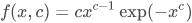,

where ```loc``` and ```scale``` parameters are changed to manipulate distribution. **This is the chosen method for generating values** and it allows performing distribution generation with shapes similar to the Gamma one, but with longer tails, which considering presence of multiple high values in transactions rises similarity of shape of this distribution with real one.

### Monte Carlo transaction simulator

There are four different approaches to generating transaction values and it is needed to connect a transaction value generator with a transaction rate generator. For those purposes was created a ```MonteCarloTransactionsSimulator``` which accepts a Poisson distribution as a frequency generator and any of the transaction values generator to generate transaction values.

The main requirements to the transaction value generator are to contain a ```generate_transactions``` function accepting last known timestamp forming new object of ```Transaction``` class writing it into the ```transaction_history``` array, and be pre-initialized with all required generation parameters

```python
timestamps = self.frequency_generator.generate_transactions(current_timestamp)
token_in_values = self.token_in_generator.generate_transactions(len(timestamps))
       
    # form new transactions and record them into 'transaction history' variable
    for index in range(len(timestamps)):
        self.transaction_history.append(Transaction(
             timestamp=timestamps[index],
             token_in_amount=token_in_values[index],
             token_in=self.first_currency,
             token_out=self.second_currency
        ))
```

Such a structure allows further adding new transaction value generation strategies if required. Below are presented different examples of how Monte Carlo simulations should be called:

```python
# several simulators, where each uses its unique values generator
normal_simulator = MonteCarloTransactionSimulator(
    PoissonGenerator(cycle_size=60000, mean_occurencies=2),
    NormalGenerator(mu=0, sigma=4500, lower_bound=0, upper_bound=10000), 'ETH', 'DAI')
 
cauchy_simulator = MonteCarloTransactionSimulator(
    PoissonGenerator(cycle_size=60000, mean_occurencies=2),
    CauchyGenerator(loc=0, scale=1000), 'ETH', 'DAI')
 
pareto_simulator = MonteCarloTransactionSimulator(
    PoissonGenerator(cycle_size=60000, mean_occurencies=2),
    ParetoGenerator(shape=3), 'ETH', 'DAI')
 
lognormal_simulator = MonteCarloTransactionSimulator(
    PoissonGenerator(cycle_size=60000, mean_occurencies=2),
    LognormalGenerator(mean=0, sigma=1), 'ETH', 'DAI')

# set current timestamp as starting point and start loop, where each iteration shifts reviewable
# timestamp further conform simulator cycle size
current_iteration_timestamp = datetime.now()
for index in range(60*24*7):
    normal_simulator.generate_transactions(current_iteration_timestamp)
    cauchy_simulator.generate_transactions(current_iteration_timestamp)
    pareto_simulator.generate_transactions(current_iteration_timestamp)
    lognormal_simulator.generate_transactions(current_iteration_timestamp)
 current_iteration_timestamp += timedelta(milliseconds=normal_simulator.frequency _generator.cycle_size)
```

### Simulations that have the best match with real life distributions
	
All presented above distributions can be used for simulating transaction values, but it is important that simulation-based and real life-based distributions should have similar shapes. The best ones are the log-normal distribution and Cauchy one.

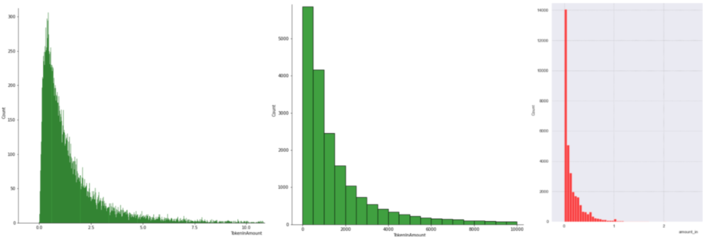

From the left to the right are lognormal distribution, Cauchy distribution and real transaction values distribution. Considering that those distributions are able to match real life distributions it is required to write an algorithm able to automatically pick best parameters for specified distributions.

### Parameter search algorithms
	
Considering that the best distributions are log-normal and Cauchy ones it was decided to write parameter picking algorithms that will be able to find the best parameters combination.

The first problem that requires solution - how algorithm will pick the best possible parameters combination, considering that all probability distribution simulations generate different values and therefore distribution can have small deviations causing probability of one launch to perform better than another one and in order to check overall efficiency it is required to perform check with multiple simulation runs (creating an average picture). Another moment is how an algorithm will check if one distribution is “similar” or “matching” another one.

Harmonic mean formula:

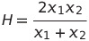

is working for two parameters. It means a harmonic two-error formula can be used to define the best possible parameters combination. Conform reviewed during the project distributions the first half of values present in distributions are the most important ones and there can be compared first quartiles and medians of two distributions, where the first distribution is a real one and the second one - simulated one. So the final representation of finding harmonic mean error is:

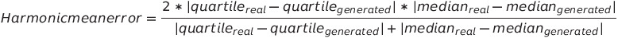

and the model will pick as best parameters such ones, where average harmonic mean error for all launches of the simulation will be minimal.

There is a range of parameters iterating through which is performed via incrementing parameter from lower bound to upper one using a step parameter. All intermediate results (each parameter set and their average harmonic error) are saved and the smallest average harmonic mean error parameter pick is chosen.

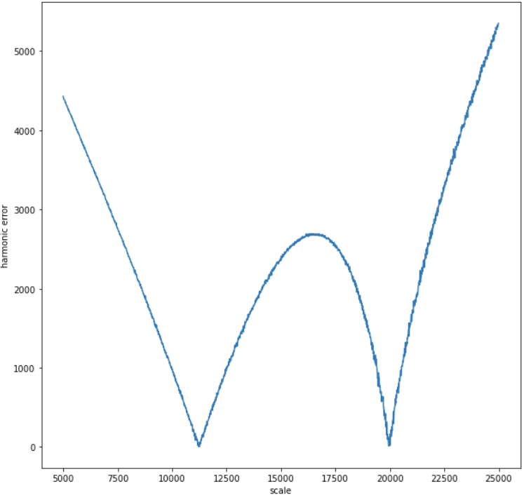

Using those principles are written ```CauchyParameterSearcher``` and ```LognormalParameterSearcher``` classes. Below is a presented example of how the distribution of harmonic mean error is picked for ```scale``` parameter starting from value 5000 till value 25000 with step of 10 and performing 1000 simulation runs.

## Transaction history

Mathematical distributions are able to simulate different market situations, but there are traders trying to perform market manipulations to extract profit out of the artificially created conditions or to perform some fraud operations. Considering that the task was not only to perform stress tests of the market but also to check for protection against those frauds and manipulations. To do that it is required to get real transaction histories.

The chosen approach was to get Uniswap V2 transaction pool histories for different types of pools, considering that traders behavior could differ depending on token reputation, popularity of the token, financial situations around him and ways to use them. There are 4 types of tokens taken:

* BitCoin and popular altcoins pools;
* NFT-related or NFT-based pools;
* Meme-coins pools
* STO-based pools.

The first case is covering the most popular tokens present on the crypto markets (BitCoin, Ethereum, USDC, FEI, HKMT), pools containing which have the highest traders interest. Those tokens can be used on many platforms with a general positive trend of their rising prices and rising reputation/recognition. Analysis of these markets will formulate a picture around the growing tokens in popularity, reputation and the number of platforms that recognize them. This behavior is necessary to understand the principles of successful projects from the initial stage of forming a pool with their participation and how the positive characteristics of tokens from a given pool predetermine their success.

The second case concerns NFT tokens that can be used on NFT exchange platforms and NFT tokens used in metaverse or web games. These are unstable markets dependent in the first case on the popularity of the NTF asset exchange platform itself, which uses tokens to exchange assets, and in the second case, it depends on the popularity and demand of the platform on which NTF data is used (within the game, it all depends on the popularity of the game and its media role). For example, an ordinary game may lose its popularity over time due to various factors, but the growing popularity of the metaverse causes the growth of the value of the NTF tokens used in them.

The third case concerns unstable but gaining popularity tokens based on memes, popular social events or personalities. These tokens are one of the most volatile on the market, since their value depends entirely on mentions in social networks, from third-party services that recognize them as payment, and the accepted methods of market regulation. With such unstable behavior, it is important to understand that these tokens are used as a means of making money quickly due to high price fluctuations. This behavior is a high risk for the holder of the currency and a good opportunity for quick earnings.

The offer of a security token (STO) is a unique case of the crypto market - either a form of investment in various blockchain projects or synthetic assets that are “mirroring” other assets. This token type is constructing a “bridge” between traditional financial market and the crypto one, introducing some traditional market practices and concepts, enlarging the crypto market influence over real world and constructing a possible future financial trading, which will be able to combine traditional and crypto financial markets.

### Analysis strategy and performed data manipulations

For each pool there were extracted 4 types (if available) of pool-related data:

* **Swap**-transaction history - history of operations, where the user requested a change of ```token_in``` to ```token_out``` called *swap*. This is a simple exchange operation and they are the main part of analysis, considering that they influence on the pool reserves, define tokens prices, through them are performed most of detected attacks;
* **Reserves** history - history of daily reserve updates formed at the end of each day. Reserves can be changed via *swap*-transactions (further called as *swaps*), *mint*-transactions (adding tokens into the pool, further called as *mints*), *burn*-transactions (extracting tokens from the pool, further called as *burns*). This history will represent an overview about how daily activity changed pools;
* **Mint**-transaction history - investment transactions, when token pair holders provide their tokens to the pool for raising pool liquidity. Tokens are inserted in the pool, increasing both tokens reserves, making the pool more persistent to happening activity;
* **Burn**-transaction history - token extraction operation history, when token pair holders extract their tokens out of the pool, decreasing pool persistence to happening activity and decreasing pool reserves.

AMM constructs token price considering available reserves keeping the original token balance formula *token_a_balance * token_b_balance = k,*
meaning that for each swap AMM generates ```token_out_value``` based on ```token_in_amount``` and current *token in to token out* price. To find out token price defined for each swap was applied the formula:

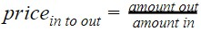

This formula defines the ```token_in``` price expressed in ```token_out``` equivalent. Knowing current token prices can be found price change rate conform formula:

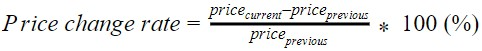

Using detected *price* and *price change rate* can be performed influential analysis of the swaps, detecting extreme market changes caused by unique conditions or fraud activity. Reserve-based token prices may not cover those unique conditions and frauds, but can be used for comparing pool token prices with prices on external markets to check if pool tokens prices are correlating with external ones. 

Uniswap V2 introduced some improvements compared to the V1 for setting manipulation-resistant environments. For example, one of the introduced protection layers is a time-weighted average price (TWAP) mechanism that works by formula with a 24 hour window:

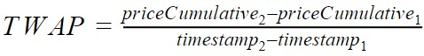

With a low transaction frequency there will be not enough estimated prices for finding time weighted one and there will be no price protection against performing specific attacks that will be further demonstrated. Taking this into account it was required to consider pool activity while checking anomalies and strange distributions with check of the token price change rates.

For performing data analysis were drawn linecharts, histograms, moving averages, rolling averages and other plotting strategies.

### MEV attack

**Miner extractable value** (MEV) is a miner profit that happens due to the ability to include/exclude/reorder transactions within the block that they produce. Current attack principle is that an attacker places a transaction right before another trader’s transaction, causing loss by this trader and placing the second transaction after another trader’s one to extract a profit from another trader’s loss. This happens due to the negative price change caused by the attacker's transaction and the next positive price change caused by another trader’s transaction.

It can look like a scheme of simple market manipulations for extracting profit out of performed actions, but attacker should have an unfair advantage of communication/connection with/to miner, to solve next two problems:

* It is required for attacker either to know order of transactions in block or to be able to manipulate this order;
* Attacker somehow must find out when trader tries performing exchange of high token values.


During multiple token pairs analysis multiple cases of MEV attacks were discovered. MEV attacks are mostly performed during rise in the trading activity increasing chances of performing efficient MEV attacks. Another observation is that for extracting higher profits out of attack it is required to cause higher price chances which totally depends on values of tokens participating in transactions and tokens reserves in the pool. With higher reserves it is more difficult to cause heavy price impact and attacker should place transaction with bigger values.

Those big values can be achieved with either high financial power of the attacker or via performing fast loan of the tokens (also called as **flash loan**) for performing attack, returning loaned tokens and keeping extracted profits (below is presented scheme of how pool reserves influence of requirements for performing efficient MEV attacks).

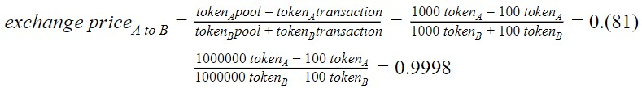

Imagine that Bob is a simple user that tries to change 100 token B to get some token A. It means that after performing swap pool will get 100 token B from Bob and give to Bob 100 token A. Imagine that in the first case there are only 1000 units of each token and in the second one there are 1000000 units of each token. In the first case, price changes by around 19%, meaning that even a relatively small transaction is able to greatly change tokens prices relative to each other. In the second case price is changed by 0.02% meaning that token price will greatly change only with much higher transaction values.

Now imagine Alice, who is trying to extract some profit from market manipulations using the MEV principle. Alice sees that there are low pool reserves in the first case and she performs a transaction by exchanging 300 token B to get token A. It means that price will greatly change:


In the first case, token A is now priced as around 0.5385 of token B, meaning that token A price was changed by around 46.15%. Then Alice tries to perform an attack over the second pool and to perform a successful attack she tries to change 30000 token B to get token A.

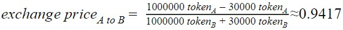

In the presented case even with a 100 times bigger transaction Alice was not successful to perform an efficient MEV attack, considering that her attack has changed price only by around 5.83%. This case demonstrates how important pool reserves are and how important it is to have big reserves to make pools more sustainable. Successful MEV attack in case of higher pool reserves requires much bigger financial power of the attacker.

### How use of stablecoins in token pairs stabilizes distributions

In most of the reviewed cases pool-based prices are converging to the real market ones. Stablecoins have stable distributions with small price deviations keeping around estimated price (like an example, price of 1 US dollar for USDC token), meaning that pool-based price distributions will converge to the distribution of altcoin, NFT, STO that was set in pair with stablecoin.

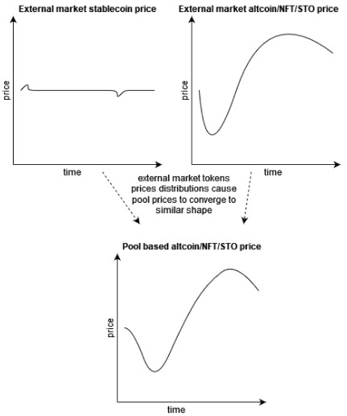

Stablecoin has stable price distribution with small deviations, while altcoin/NFT/STO price has higher deviation/changes causing pool-based altcoin/NFT/STO price converge to the external markets price.

In case if there are both tokens in the token pair of the pool either altcoin or NFT or STO, then pool-based prices will depend on both external market prices distributions, causing low market sustainability. The problem of such a structure is that the pool can become a good source of extracting priceful tokens out of the pool. Therefore, pool-based prices will be less stable and there is a higher chance of appearing disturbances. After reviewing many pools, one observation was found that in most of the cases use of such token pair structure causes higher deviations and smaller pool stability.

# MEV attacks analysis

During analysis of the traders behavior were discovered multiple cases of strange transactions that were performing market manipulations to extract profits out of changed token prices causing losses of the traders that were catched in some sort of a "sandwich" of price-manipulative transactions. Due to those manipulations traders got big losses of their profits and it was decided to analyse those attacks, discovering their patterns, structure, profits that attackers are able to extract out of those activities and what are main targets of those attackers.

Above is presented short description with explanation of how MEV attacks work and here will be mentioned only some generic observations, used Jupyter Notebooks for performing this analysis and parts of code used for performing this analysis.

## Used code for performing analysis

### Libraries

MEV attacks analysis required several important moments:

1. Finding influence of mitigation mechanism on MEV attacks, which is possible via performing simulation over downloaded data;
2. Finding MEV attacks with exact incoming and outcoming values match for one of the sides;
3. Set visualization instruments required for comparison of simulation results and therefore comparison of mitigation mechanism results and MEV attacks comparison;
4. Estimation of profits extracted by attackers in tokens that were used inside pool;
5. Calculation of daily end-of-day price distribution for tokens participating in the pool, used for profits recalculation to US dollars;
6. Finding some MEV attacks metrics used for comparison of MEV attacks between pools.

All those elements were realized in the ```simulation_core.py``` file placed in ```libs``` folder. Using this library it is possible to perform efficient pools analysis and analysis of MEV attacks.

During analysis of the data were discovered many cases of MEV attacks and considering that original datasets downloaded fron Uniswap had no information regarding gas spendings it was decided to perform additional download of the data to make estimation of netto profit and see how gas impacts MEV attacks profits distribution.

### Etherscan scrapper

The best resource containing information about transaction data and properties is Etherscan, where can be verified many aspects of performed transactions. It was required to perform download of the MEV attack related information about gas fees and gas spendings from Etherscan. The problem is that there was no API providing this information, search of subgraphs for this data was not successful (the only found subgraph was providing information about user-estimated maximal amount of gas that user is ready to spend for transaction instead of used gas) and the only option for getting this data was by setting a chrome driver collecting data only about MEV attacks transactions gas spendings. This information was connected to the Uniswap collected information about those attacks and generated information about profits. Code related to this part is located in ```web_scrapper``` section with ```etherscan_scrapper.ipynb```.

### Pools simulations analysis and basic MEV attacks analysis Jupyter notebooks

Analysis of pools separated by token types is located in files ```uni_classic_simulations.ipynb, uni_meme_simulations.ipynb, uni_nft_simulations.ipynb, uni_sto_simulations.ipynb``` (in section ```simulations/uniswap_pools```) and contain analysis of all pools and some basic MEV attacks analysis with estimation of simple connections between attacks, token types, activity in pools.

Out of the presented pools can be seen that highest activities are registered in classic and meme tokens pools. NFT-related tokens pools demonstrate medium level activity, while STO tokens pools contain little amount of transactions. Depending on token type can be seen how different is MEV attacks frequency - while NFT and meme tokens pools contain high amount of performed attacks respective to simple traders activity performed in those pools, classic and STO tokens pools contain much smaller amount of performed attacks and their distributions are unstable.

Mitigation mechanism is able to catch all transactions with heavy impact on the price distribution and prevent their execution, smoothing price and reserves distributions. MEV attacks are performed to extract profits and their values are not always causing heavy price changes and in most of the cases their changes are small, but enough to extract profits. There are two reasons why attackers perform their activity with no extreme changes:

* Attackers are not willing to stand out of distributions by the impact that they cause to the pool (less likely);
* Attackers are performing attacks in such a manner that even if victim sets a slippage to evade big losses platform will not decline victim's transaction, ensuring extraction of profit out of attack.

Another problem of mitigation mechanism is that it is not always available due to performed transactions (it is possible to find TWAP if there were enough transactions in given time window) and therefore mitigation may skip even heavy attacks.

### MEV attacks analysis by their frequency, profits, gas spendings

Out of all reviewed pools can be seen how big are profits extracted from NFT and meme tokens pools. Frequency of those attacks is higher even considering higher gas spendings. Why MEV attackers are performing higher activity in those pools, but not in classic and STO tokens pools?


This may be caused by the trading principle behind classic and STO tokens pools. 

Classic tokens represent case of the most popular tokens in the cryptotrading and their price distributions have positive trends with the highest chances of recovering their prices in case of drops, meaning that they are some sort of a standard for crypto markets. With such properties chances of having big losses of capital are low. Traders are not so interested in performing fast traders with price changes on the market.

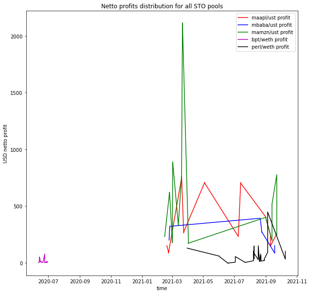

STO tokens represent another case, when tokens value is connected to the real-world value, shares of companies, or coins used for both supporting activity of the company and for performing inner activities on the platform of this company. With any of those cases price distribution is smoothed and chances of events having powerful impact on price are low. Traders have low risks of losing their capital and therefore their activity will be more stable.

In both of the presented cases chances of performing trades with extreme capitalization are low. Another problem is that user can set a slippage parameter to prevent big losses during trading and "window" of possible price manipulations is smaller because with bigger price changes victim's transaction can be prevented and there won't be any profit extraction (such a situation will even lead to losses caused by gas spendings). There are two remaining token types that solve mentioned for attackers problems.

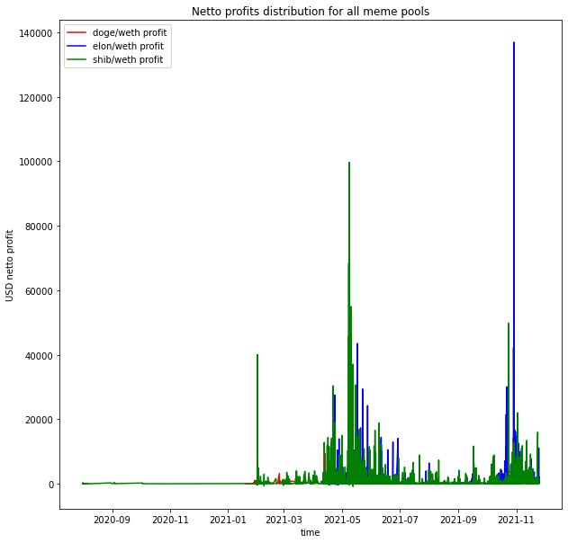

Prices of meme tokens and NFT tokens are speculative. They are totally based on supply and demand. Price of NFT tokens depend on popularity of the goods/services locked behind those tokens and while those goods/services are demanded - price will hold. For example, in case of making NFT tokens inside online game, their price depends on popularity of this game, in case of NFT token related to some art price depends on popularity of this art (of exact art unit). Price of meme tokens is purely speculative and its distribution is almost unpredictable. Any social media mentioning of meme token, any external impact may cause heavy price change. Considering such an unpredictable behavior, impossibility of being sure that price of the token will recover after heavy drop and how long will last higher price and if it will rise further, traders are trying to use any chance of extracting profits out of those tokens. This can be achieved by performing trades as fast as possible in case of price change. This is the reason why trading activity is unstable and there are moments of anomalous rises in activity. This is also a reason why gas spendings for performing attacks on meme and NFT pools is higher compared to the other two token types - anomalously high activity causes rise of gas spendings due to higher load on miners.

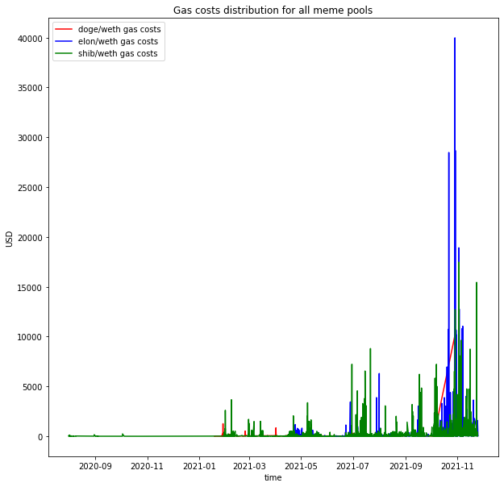

Attackers demonstrated higher attention to meme and NFT pools. Therefore it is possible to say that they are most vulnerable to the attackers. Interesting moment here is that application of mitigation mechanism will not cause beneficial impact on those pools. The problem is that trades are performed in specific days of price changes more often and mitigation will either cause no effect in case of too small transaction frequency before and after active days or prevent even simple transactions because they are heavily shifting pool prices closer to real-market price distribution that changed heavily.

Review of the addresses involved in MEV attacks demonstrated that there is a group of addresses performing most of the attacks. Activity of those addresses is temporary meaning that their activity after some time of collecing profits stops. Such approach allows attackers to perform attacks using different addresses (maybe combine several MEV bots) and setting list of addresses that should be blocked will not solve the problem (or it will require repetative check of activity with attackers identification). MEV attackers have complex schemes of extracting their profits and it is possible to deal with them only via market regulation.

The most interesting part of their activity is that any person performing honest trades can evade chance of becoming victim of such attack via setting slippage parameter in such a manner, that losses would be minimal, even if attacker will try to extract profit out of it. Raised gas fees for performing trades with higher usage of slippage will greatly reduce activity of those attackers.

# What's next?

Other interesting moments can be found in the ```pdf``` report present in the project.