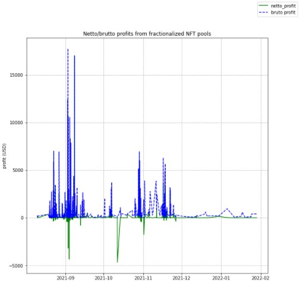

# MEV attacks analysis

- [MEV attacks analysis](#mev-attacks-analysis)
  - [Used code for performing analysis](#used-code-for-performing-analysis)
    - [Libraries](#libraries)
    - [Etherscan scrapper](#etherscan-scrapper)
  - [Pools simulations analysis and basic MEV attacks analysis Jupyter notebooks](#pools-simulations-analysis-and-basic-mev-attacks-analysis-jupyter-notebooks)
  - [MEV attacks analysis by their frequency, profits, gas spendings](#mev-attacks-analysis-by-their-frequency-profits-gas-spendings)

During analysis of the traders behavior were discovered multiple cases of strange transactions that were performing market manipulations to extract profits out of changed token prices causing losses of the traders that were catched in some sort of a "sandwich" of price-manipulative transactions. Due to those manipulations traders got big losses of their profits and it was decided to analyse those attacks, discovering their patterns, structure, profits that attackers are able to extract out of those activities and what are main targets of those attackers.

Above is presented short description with explanation of how MEV attacks work and here will be mentioned only some generic observations, used Jupyter Notebooks for performing this analysis and parts of code used for performing this analysis.

## Used code for performing analysis

### Libraries

MEV attacks analysis required several important moments:

1. Finding influence of mitigation mechanism on MEV attacks, which is possible via performing simulation over downloaded data;
2. Finding MEV attacks with exact incoming and outcoming values match for one of the sides;
3. Set visualization instruments required for comparison of simulation results and therefore comparison of mitigation mechanism results and MEV attacks comparison;
4. Estimation of profits extracted by attackers in tokens that were used inside pool;
5. Calculation of daily end-of-day price distribution for tokens participating in the pool, used for profits recalculation to US dollars;
6. Finding some MEV attacks metrics used for comparison of MEV attacks between pools.

All those elements were realized in the ```simulation_core.py``` file placed in ```libs``` folder. Using this library it is possible to perform efficient pools analysis and analysis of MEV attacks.

During analysis of the data were discovered many cases of MEV attacks and considering that original datasets downloaded fron Uniswap had no information regarding gas spendings it was decided to perform additional download of the data to make estimation of netto profit and see how gas impacts MEV attacks profits distribution.

### Etherscan scrapper

The best resource containing information about transaction data and properties is Etherscan, where can be verified many aspects of performed transactions. It was required to perform download of the MEV attack related information about gas fees and gas spendings from Etherscan. The problem is that there was no API providing this information, search of subgraphs for this data was not successful (the only found subgraph was providing information about user-estimated maximal amount of gas that user is ready to spend for transaction instead of used gas) and the only option for getting this data was by setting a chrome driver collecting data only about MEV attacks transactions gas spendings. This information was connected to the Uniswap collected information about those attacks and generated information about profits. Code related to this part is located in ```web_scrapper``` section with ```etherscan_scrapper.ipynb```.

## Pools simulations analysis and basic MEV attacks analysis Jupyter notebooks

Analysis of pools separated by token types is located in files ```uni_classic_simulations.ipynb, uni_meme_simulations.ipynb, uni_nft_simulations.ipynb, uni_sto_simulations.ipynb``` (in section ```simulations/uniswap_pools```) and contain analysis of all pools and some basic MEV attacks analysis with estimation of simple connections between attacks, token types, activity in pools.

Out of the presented pools can be seen that highest activities are registered in classic and meme tokens pools. NFT-related tokens pools demonstrate medium level activity, while STO tokens pools contain little amount of transactions. Depending on token type can be seen how different is MEV attacks frequency - while NFT and meme tokens pools contain high amount of performed attacks respective to simple traders activity performed in those pools, classic and STO tokens pools contain much smaller amount of performed attacks and their distributions are unstable.

Mitigation mechanism is able to catch all transactions with heavy impact on the price distribution and prevent their execution, smoothing price and reserves distributions. MEV attacks are performed to extract profits and their values are not always causing heavy price changes and in most of the cases their changes are small, but enough to extract profits. There are two reasons why attackers perform their activity with no extreme changes:

* Attackers are not willing to stand out of distributions by the impact that they cause to the pool (less likely);
* Attackers are performing attacks in such a manner that even if victim sets a slippage to evade big losses platform will not decline victim's transaction, ensuring extraction of profit out of attack.

Another problem of mitigation mechanism is that it is not always available due to performed transactions (it is possible to find TWAP if there were enough transactions in given time window) and therefore mitigation may skip even heavy attacks.

## MEV attacks analysis by their frequency, profits, gas spendings

Out of all reviewed pools can be seen how big are profits extracted from NFT and meme tokens pools. Frequency of those attacks is higher even considering higher gas spendings. Why MEV attackers are performing higher activity in those pools, but not in classic and STO tokens pools?


This may be caused by the trading principle behind classic and STO tokens pools. 

Classic tokens represent case of the most popular tokens in the cryptotrading and their price distributions have positive trends with the highest chances of recovering their prices in case of drops, meaning that they are some sort of a standard for crypto markets. With such properties chances of having big losses of capital are low. Traders are not so interested in performing fast traders with price changes on the market.


STO tokens represent another case, when tokens value is connected to the real-world value, shares of companies, or coins used for both supporting activity of the company and for performing inner activities on the platform of this company. With any of those cases price distribution is smoothed and chances of events having powerful impact on price are low. Traders have low risks of losing their capital and therefore their activity will be more stable.

In both of the presented cases chances of performing trades with extreme capitalization are low. Another problem is that user can set a slippage parameter to prevent big losses during trading and "window" of possible price manipulations is smaller because with bigger price changes victim's transaction can be prevented and there won't be any profit extraction (such a situation will even lead to losses caused by gas spendings). There are two remaining token types that solve mentioned for attackers problems.


Prices of meme tokens and NFT tokens are speculative. They are totally based on supply and demand. Price of NFT tokens depend on popularity of the goods/services locked behind those tokens and while those goods/services are demanded - price will hold. For example, in case of making NFT tokens inside online game, their price depends on popularity of this game, in case of NFT token related to some art price depends on popularity of this art (of exact art unit). Price of meme tokens is purely speculative and its distribution is almost unpredictable. Any social media mentioning of meme token, any external impact may cause heavy price change. Considering such an unpredictable behavior, impossibility of being sure that price of the token will recover after heavy drop and how long will last higher price and if it will rise further, traders are trying to use any chance of extracting profits out of those tokens. This can be achieved by performing trades as fast as possible in case of price change. This is the reason why trading activity is unstable and there are moments of anomalous rises in activity. This is also a reason why gas spendings for performing attacks on meme and NFT pools is higher compared to the other two token types - anomalously high activity causes rise of gas spendings due to higher load on miners.


Attackers demonstrated higher attention to meme and NFT pools. Therefore it is possible to say that they are most vulnerable to the attackers. Interesting moment here is that application of mitigation mechanism will not cause beneficial impact on those pools. The problem is that trades are performed in specific days of price changes more often and mitigation will either cause no effect in case of too small transaction frequency before and after active days or prevent even simple transactions because they are heavily shifting pool prices closer to real-market price distribution that changed heavily.

There was also performed analysis of the Sushiswap pools containing fractionalized NFT tokens. Review of the pool history demonstrated extremely high gas fees that reduce almost 75% of the profit collected by performing a MEV attack. Such a big loss of profit makes attacks low-profitable and less attractive for the attackers. While netto profits are low, collected brutto profits are similar to the case of NFT-related pools and profits can be good enough for the attackers in case of catching low gas price periods. The principle behind attack strategy is similar to the case of meme tokens pools, where traders perform their activity during price changes. Because of higher load on miners, fees are increasing and profitability of the attack decreases (below is presented chart of brutto/netto profits of reviewed fractionalized NFT pools - DOG/WETH, LADY/WETH, NFD/WETH, TIARA/WETH).



Review of the addresses involved in MEV attacks demonstrated that there is a group of addresses performing most of the attacks. Activity of those addresses is temporary meaning that their activity after some time of collecing profits stops. Such approach allows attackers to perform attacks using different addresses (maybe combine several MEV bots) and setting list of addresses that should be blocked will not solve the problem (or it will require repetative check of activity with attackers identification). MEV attackers have complex schemes of extracting their profits and it is possible to deal with them only via market regulation.

The most interesting part of their activity is that any person performing honest trades can evade chance of becoming victim of such attack via setting slippage parameter in such a manner, that losses would be minimal, even if attacker will try to extract profit out of it. Raised gas fees for performing trades with higher usage of slippage will greatly reduce activity of those attackers.