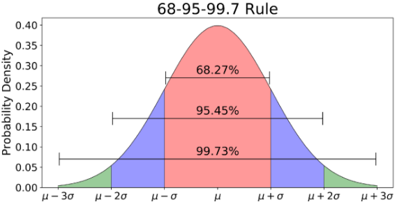
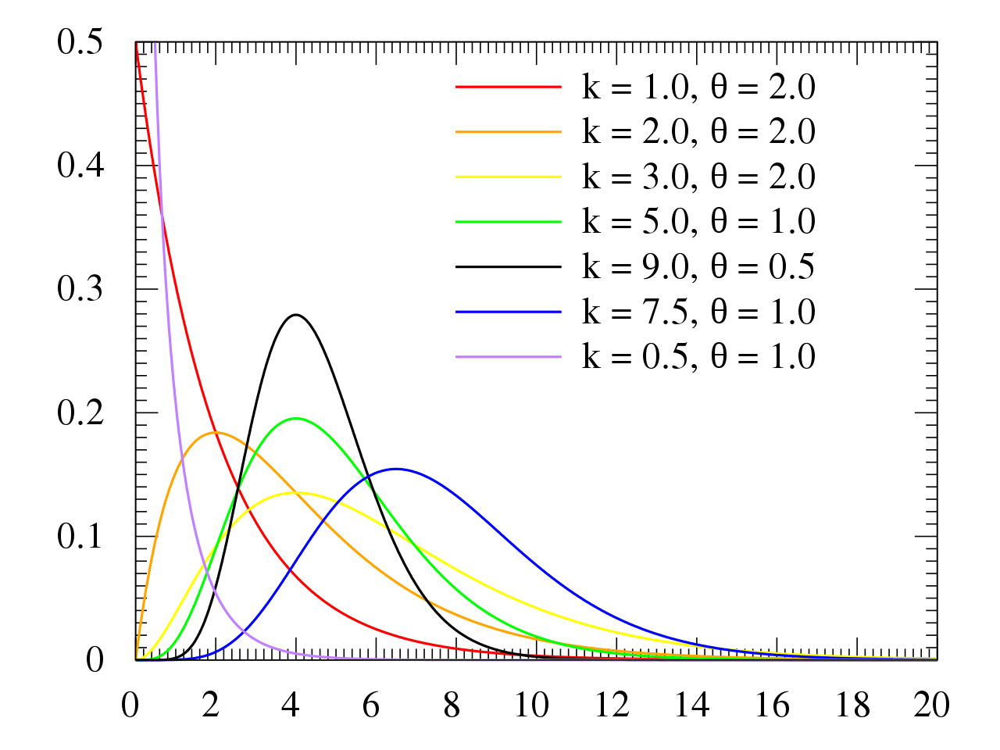

# Monte Carlo simulation

This chapter will be described with the next structure:

  - [Monte-Carlo code structure](#monte-carlo-code-structure)
  - [Transaction frequency generator or Poisson generator](#transaction-frequency-generator-or-poisson-generator)
  - [Normal distribution generator](#normal-distribution-generator)
  - [Log-normal distribution generator](#log-normal-distribution-generator)
  - [Pareto distribution generator](#pareto-distribution-generator)
  - [Cauchy distribution generator](#cauchy-distribution-generator)
  - [Gamma distribution generator](#gamma-distribution-generator)
  - [WeiBull distribution generator](#weibull-distribution-generator)
  - [Monte Carlo transaction simulator](#monte-carlo-transaction-simulator)
  - [Simulations that have the best match with real life distributions](#simulations-that-have-the-best-match-with-real-life-distributions)
  - [Parameter search algorithms](#parameter-search-algorithms)

## Monte-Carlo code structure

* ```monte_carlo.py``` - file with realization of Monte-Carlo simulation classes:
  * ```Transaction``` class - allows simulating swap-based transactions on the AMM market;
  * ```PoissonGenerator``` class - responsible for defining amount of transaction happening per minute using Poisson distribution probability principle;
  * ```NormalGenerator``` class - sets transaction values randomly conform normal distribution;
  * ```LogNormalGenerator``` class - sets transaction values randomly conform log-normal distribution;
  * ```CauchyGenerator``` class - sets transaction values randomly conform Cauchy distribution;
  * ```ParetoGenerator``` class - sets transaction values randomly conform Pareto distribution;
  * ```MonteCarloTransactionsSimulator``` class - responsible for creating required transaction history using specific (chosen) transaction values generator;
  * ```LogNormalParameterSearcher``` class - picks best parameters to make log-normal distribution look as close as possible to the given distribution;
  * ```CauchyParameterSearcher``` class - picks best parameters to make Cauchy distribution look as close as possible to the given distribution.

## Transaction frequency generator or Poisson generator

The first problem that appeared during implementation of the transaction history simulation was the fact that there is some average transaction frequency per specified time interval, but transaction count per specified time interval is unstable, meaning that different time periods have different amounts of transactions happening. Another moment is that transactions are happening in different positions on the specified time intervals. To solve those problems it was decided to use Poisson distribution generators.

Poisson distribution is a discrete probability distribution that expresses the probability of a given number of events happening in fixed time intervals with a constant mean rate and independently from the last event time (it can also be applied to other metrics like distance). The formula for the Poisson Distribution is:


where *e* is representing Euler’s number, *x* represents the number of event occurrences, *lambda* is equal to the expected value of *x* also equal to its variance. 

```NumPy``` library contains a ```random``` module with method ```poisson``` which creates values that conform to Poisson distribution based on the transmitted parameters. It generates the amount of transactions that happen during a specific time interval, but it is required to specify transaction timestamps. This moment is solved by applying random timedelta to the given time interval starting timestamp for each transaction separately. 

## Normal distribution generator

Normal distribution is also a normal probability distribution for a real-valued random variable that contains next formula:


where *mu* is the mean or expectation of the distribution, *sigma* is the standard deviation, *e* is Euler’s constant. Probability density function of this distribution is also noted as *ф(x)*. Normal distribution looks like chart presented below:



The only problem of this distribution is that there is a possibility of producing negative values that should not be present in the transaction values. The only way to evade negative values production is use of the truncated normal distribution conform next formula:


In this formula *ф(x)* represents a probability density function of the "parent" general normal distribution with mean, variance, truncation interval represented by *a* and *b*. There is one more symbol requiring explanation - the *Ф* one. Imagine a situation where is needed to determine the probability that a distribution will generate a value less than a specified value of *x*. The calculation of this probability will be according to the following function:


```Scipy.stats``` module contains a function called ```truncnorm``` dedicated to generating truncated normal distribution conform specified values interval. This function works with ```mu``` parameter representing mean distribution value, ```sigma``` representing standard deviation of the distribution, ```lower bound``` and ```upper bound``` representing values interval. Values are generated with next call:

```python
return truncnorm.rvs((self.lower_bound - self.mu)/self.sigma, (self.upper_bound - self.mu)/self.sigma, loc=self.mu, scale=self.sigma, size=transactions_count)
```

## Log-normal distribution generator

Log normal distribution is the probability distribution of a random variable whose logarithm is normally distributed. Conform this distribution generated value x can be described by the formula:


where *Z* is a standard normal variable, *mu* represents distribution mean and *sigma* - standard deviation. Considering that traders' activity has extreme rises and drops it is required to consider such a case, which is covered by this type of distribution.


```numpy.random``` module contains ```lognormal``` function used for generating values conforming to Log-Normal probability distribution working by a similar principle as previous methods of sigma and mu parameters.

## Pareto distribution generator
	
Pareto distribution is the power-law probability distribution that is used in description of social, quality control, scientific, and other types of phenomenons. The base principle behind this distribution is the “80 to 20” rule that describes distribution of wealth in society and therefore this distribution should cover better traders' activity simulation tasks. The probability distribution function is:


where *x_m* is a minimal possible value of *X* (also called as ```scale``` parameter) and shape parameter *a*.


```numpy.random``` module has a function called ```pareto``` that is responsible for generating the Pareto distribution.

## Cauchy distribution generator

Cauchy distribution is a probability distribution of the x-intercept of a ray issuing from (x0, ) with a uniformly distributed angle. Formula:


where *x0* is locational parameter setting location of the distribution peak and *mu* is the scale parameter which specifies the half-width and half-maximum.

```scipy.stats.halfcauchy``` module contains the ```rvs``` function which is responsible for generating values conforming to the Cauchy distribution without negative values, meaning that generated values will match real transactions values.

There is still one problem remaining about Cauchy - it is able to give unrealistically big transaction values, meaning that there is a small chance that there will appear anomalous value which is not corresponding to the real world case. This problem was solved via “mapping” values mechanism, graphical representation of which can be understood from given example:


“Mapping” formula:


where the *generated value* is representing the original Cauchy generated value, the *limit* demonstrates the upper bound of the possible values. Such an algorithm allows keeping the original Cauchy distribution almost unchanged (without breaking the probabilities) and producing values only of specific limit.

```python
return value / ((value // self.limit) + 1)
```

## Gamma distribution generator

Gamma distribution is represents two-parametric distribution which is used in describing system degradation, obsolescence and failure. Distribution is controlled via changing lambda and alpha parameters. Distribution is described by the next formula:


Distribution looks like exponential one and change of values cause next distribution of values:



Considering that most of the transactions are performed with lower values and their distribution looks like exponential one, this distribution may be used for performing trades generation and it is possible that it will perform great in solving simulation problems.

**Scipy** contains method ```scipy.stats.gamma``` is used for generating values conform gamma distribution. The probability density standardized function is present in form:

,

where *Г(a)* is a gamma function shown above and takes *a* is shape parameter. *a* equal to integer value reduces to Erlang distribution, where *a = 1* reduces to the exponential function.

## WeiBull distribution generator

Concept behind Weibull distribution is similar to the case of Gamma function and describes failure rate considering wearout and burning failures. From the first look this concept does not look like applicable for the current simulations, but it is important to mention that it performs as an exponential function similar to gamma one, but more changeable and adaptive to changed parameters. Weibull is controlled via scale and shape parameters. Correct use of those parameters is able to make distribution similar to the transaction values probability density function.


Distributions look similar to reviewed transaction values distributions and tuneability of this distribution is relatively easy.


**Numpy** library contains method required for generating values conform WeiBull distribution. ```numpy.random.weibull``` contains several implementations of Weibull distribution with variants of tunening one, two and three parameters of the distribution. This is one of the implementations, **but not the one chosen for this work**.

**Scipy** library contains method ```scipy.stats.weibull_min```. The probability density function in "standardized" form:

,

where ```loc``` and ```scale``` parameters are changed to manipulate distribution. **This is the chosen method for generating values** and it allows performing distribution generation with shapes similar to the Gamma one, but with longer tails, which considering presence of multiple high values in transactions rises similarity of shape of this distribution with real one.

## Monte Carlo transaction simulator

There are four different approaches to generating transaction values and it is needed to connect a transaction value generator with a transaction rate generator. For those purposes was created a ```MonteCarloTransactionsSimulator``` which accepts a Poisson distribution as a frequency generator and any of the transaction values generator to generate transaction values.

The main requirements to the transaction value generator are to contain a ```generate_transactions``` function accepting last known timestamp forming new object of ```Transaction``` class writing it into the ```transaction_history``` array, and be pre-initialized with all required generation parameters

```python
timestamps = self.frequency_generator.generate_transactions(current_timestamp)
token_in_values = self.token_in_generator.generate_transactions(len(timestamps))
       
    # form new transactions and record them into 'transaction history' variable
    for index in range(len(timestamps)):
        self.transaction_history.append(Transaction(
             timestamp=timestamps[index],
             token_in_amount=token_in_values[index],
             token_in=self.first_currency,
             token_out=self.second_currency
        ))
```

Such a structure allows further adding new transaction value generation strategies if required. Below are presented different examples of how Monte Carlo simulations should be called:

```python
# several simulators, where each uses its unique values generator
normal_simulator = MonteCarloTransactionSimulator(
    PoissonGenerator(cycle_size=60000, mean_occurencies=2),
    NormalGenerator(mu=0, sigma=4500, lower_bound=0, upper_bound=10000), 'ETH', 'DAI')
 
cauchy_simulator = MonteCarloTransactionSimulator(
    PoissonGenerator(cycle_size=60000, mean_occurencies=2),
    CauchyGenerator(loc=0, scale=1000), 'ETH', 'DAI')
 
pareto_simulator = MonteCarloTransactionSimulator(
    PoissonGenerator(cycle_size=60000, mean_occurencies=2),
    ParetoGenerator(shape=3), 'ETH', 'DAI')
 
lognormal_simulator = MonteCarloTransactionSimulator(
    PoissonGenerator(cycle_size=60000, mean_occurencies=2),
    LognormalGenerator(mean=0, sigma=1), 'ETH', 'DAI')

# set current timestamp as starting point and start loop, where each iteration shifts reviewable
# timestamp further conform simulator cycle size
current_iteration_timestamp = datetime.now()
for index in range(60*24*7):
    normal_simulator.generate_transactions(current_iteration_timestamp)
    cauchy_simulator.generate_transactions(current_iteration_timestamp)
    pareto_simulator.generate_transactions(current_iteration_timestamp)
    lognormal_simulator.generate_transactions(current_iteration_timestamp)
 current_iteration_timestamp += timedelta(milliseconds=normal_simulator.frequency _generator.cycle_size)
```

## Simulations that have the best match with real life distributions
	
All presented above distributions can be used for simulating transaction values, but it is important that simulation-based and real life-based distributions should have similar shapes. The best ones are the log-normal distribution and Cauchy one.


From the left to the right are lognormal distribution, Cauchy distribution and real transaction values distribution. Considering that those distributions are able to match real life distributions it is required to write an algorithm able to automatically pick best parameters for specified distributions.

## Parameter search algorithms
	
Considering that the best distributions are log-normal and Cauchy ones it was decided to write parameter picking algorithms that will be able to find the best parameters combination.

The first problem that requires solution - how algorithm will pick the best possible parameters combination, considering that all probability distribution simulations generate different values and therefore distribution can have small deviations causing probability of one launch to perform better than another one and in order to check overall efficiency it is required to perform check with multiple simulation runs (creating an average picture). Another moment is how an algorithm will check if one distribution is “similar” or “matching” another one.

Harmonic mean formula:


is working for two parameters. It means a harmonic two-error formula can be used to define the best possible parameters combination. Conform reviewed during the project distributions the first half of values present in distributions are the most important ones and there can be compared first quartiles and medians of two distributions, where the first distribution is a real one and the second one - simulated one. So the final representation of finding harmonic mean error is:


and the model will pick as best parameters such ones, where average harmonic mean error for all launches of the simulation will be minimal.

There is a range of parameters iterating through which is performed via incrementing parameter from lower bound to upper one using a step parameter. All intermediate results (each parameter set and their average harmonic error) are saved and the smallest average harmonic mean error parameter pick is chosen.


Using those principles are written ```CauchyParameterSearcher``` and ```LognormalParameterSearcher``` classes. Below is a presented example of how the distribution of harmonic mean error is picked for ```scale``` parameter starting from value 5000 till value 25000 with step of 10 and performing 1000 simulation runs.