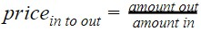
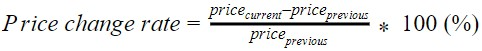
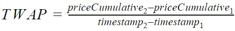
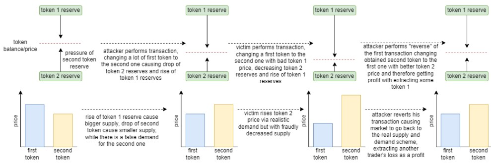
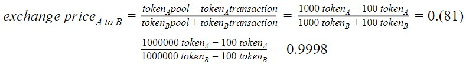
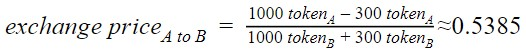
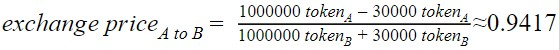
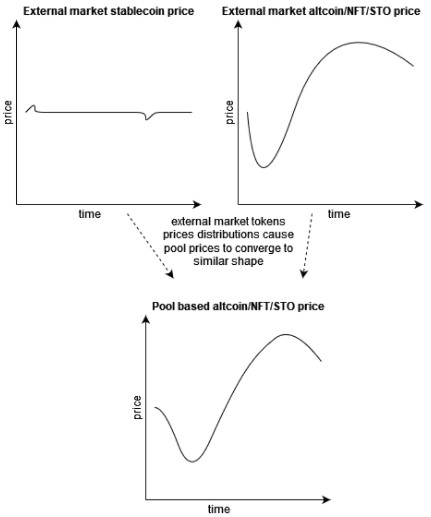

# Transaction history

This chapter will be described with the next structure:

- [Transaction history](#transaction-history)
- [Code structure:](#code-structure)
- [Overview](#overview)
    - [Analysis strategy and performed data manipulations](#analysis-strategy-and-performed-data-manipulations)
    - [MEV attack](#mev-attack)
    - [How use of stablecoins in token pairs stabilizes distributions](#how-use-of-stablecoins-in-token-pairs-stabilizes-distributions)

# Code structure:

* ```uniswap_v2_extractor.py``` - file with realization of classes used to extract transaction histories for specified contracts from Uniswap V2:
  * ```get_pool_v2_reserves_history``` extracts list of reserve updates, ```list_to_reserves_dictionary``` changes data type of reserves update record data from list to dictionary which be further inserted into Pandas DataFrame, ```pool_reserves_to_df``` performs transformation of list of lists reserves updates into reserves history Pandas DataFrame;
  * ```get_pool_v2_history``` extracts swap-transactions history from Uniswap V2. ```list_to_transaction_dictionary``` transforms swap-transaction data from list into dictionary, ```pool_history_to_df``` performs swap-transaction history from list of lists form into Pandas DataFrame;
  * ```get_pool_v2_mints``` and ```get_pool_v2_burns``` extract list of burns and mints histories in lists form, ```list_to_mints_dictionary``` changes each burn or mint record from list to the dictionary form, ```pool_mints_to_df``` and ```pool_burns_to_df``` transform burns or mints histories for lists of lists into Pandas DataFrames;
  * ```filter_swaps``` extract direct swaps and other ones (like “flash” ones), separating them.
* ```uniswap_v2_plots.py``` - file containing plots functions:
  * ```show_swaps_count_moving_averages``` - show moving daily average and one week rolling average line plots for swaps operations count;
  * ```show_swaps_reserves_evolution_through_time``` - show reserves changes line plots through time for specified pool;
  * ```show_pool_price_evolution_from_reserves``` - show reserve-based token prices line plots through time;
  * ```show_swaps_amount_in_moving_averages``` - show swaps activity capitalization (counted respective to tokens) for one day and week rolling average through time;
* ```transaction_history_v3_tools.py``` - file containing class used to work with transaction histories taken from Uniswap V3. Class contains some specific big methods to work with V3 histories:
  * ```classify_history``` separate transaction history conform their properties (swaps, mints, burns, anomalies);
  * ```form_moving_averages_for_token``` creates distributions one day average and one week rolling average for each transaction type for specified token;
  * ```lineplots_matrix``` shows matrix of line plots charts;
  * ```histplots_matrix``` shows matrix of histograms charts;
  * ```show_transactions_frequencies_per_minute``` prints transaction frequency for each transaction type per minute;
  * ```show_min_max_values_by_token``` prints minimal and maximal values for each transaction type;
  * ```lineplots_moving_averages_matrix_by_token``` shows line plots moving averages by token matrix.

# Overview

Mathematical distributions are able to simulate different market situations, but there are traders trying to perform market manipulations to extract profit out of the artificially created conditions or to perform some fraud operations. Considering that the task was not only to perform stress tests of the market but also to check for protection against those frauds and manipulations. To do that it is required to get real transaction histories.

The chosen approach was to get Uniswap V2 transaction pool histories for different types of pools, considering that traders behavior could differ depending on token reputation, popularity of the token, financial situations around him and ways to use them. There are 4 types of tokens taken:

* BitCoin and popular altcoins pools;
* NFT-related or NFT-based pools;
* Meme-coins pools
* STO-based pools.

The first case is covering the most popular tokens present on the crypto markets (BitCoin, Ethereum, USDC, FEI, HKMT), pools containing which have the highest traders interest. Those tokens can be used on many platforms with a general positive trend of their rising prices and rising reputation/recognition. Analysis of these markets will formulate a picture around the growing tokens in popularity, reputation and the number of platforms that recognize them. This behavior is necessary to understand the principles of successful projects from the initial stage of forming a pool with their participation and how the positive characteristics of tokens from a given pool predetermine their success.

The second case concerns NFT tokens that can be used on NFT exchange platforms and NFT tokens used in metaverse or web games. These are unstable markets dependent in the first case on the popularity of the NTF asset exchange platform itself, which uses tokens to exchange assets, and in the second case, it depends on the popularity and demand of the platform on which NTF data is used (within the game, it all depends on the popularity of the game and its media role). For example, an ordinary game may lose its popularity over time due to various factors, but the growing popularity of the metaverse causes the growth of the value of the NTF tokens used in them.

The third case concerns unstable but gaining popularity tokens based on memes, popular social events or personalities. These tokens are one of the most volatile on the market, since their value depends entirely on mentions in social networks, from third-party services that recognize them as payment, and the accepted methods of market regulation. With such unstable behavior, it is important to understand that these tokens are used as a means of making money quickly due to high price fluctuations. This behavior is a high risk for the holder of the currency and a good opportunity for quick earnings.

The offer of a security token (STO) is a unique case of the crypto market - either a form of investment in various blockchain projects or synthetic assets that are “mirroring” other assets. This token type is constructing a “bridge” between traditional financial market and the crypto one, introducing some traditional market practices and concepts, enlarging the crypto market influence over real world and constructing a possible future financial trading, which will be able to combine traditional and crypto financial markets.

### Analysis strategy and performed data manipulations

For each pool there were extracted 4 types (if available) of pool-related data:

* **Swap**-transaction history - history of operations, where the user requested a change of ```token_in``` to ```token_out``` called *swap*. This is a simple exchange operation and they are the main part of analysis, considering that they influence on the pool reserves, define tokens prices, through them are performed most of detected attacks;
* **Reserves** history - history of daily reserve updates formed at the end of each day. Reserves can be changed via *swap*-transactions (further called as *swaps*), *mint*-transactions (adding tokens into the pool, further called as *mints*), *burn*-transactions (extracting tokens from the pool, further called as *burns*). This history will represent an overview about how daily activity changed pools;
* **Mint**-transaction history - investment transactions, when token pair holders provide their tokens to the pool for raising pool liquidity. Tokens are inserted in the pool, increasing both tokens reserves, making the pool more persistent to happening activity;
* **Burn**-transaction history - token extraction operation history, when token pair holders extract their tokens out of the pool, decreasing pool persistence to happening activity and decreasing pool reserves.

AMM constructs token price considering available reserves keeping the original token balance formula *token_a_balance * token_b_balance = k,*
meaning that for each swap AMM generates ```token_out_value``` based on ```token_in_amount``` and current *token in to token out* price. To find out token price defined for each swap was applied the formula:



This formula defines the ```token_in``` price expressed in ```token_out``` equivalent. Knowing current token prices can be found price change rate conform formula:



Using detected *price* and *price change rate* can be performed influential analysis of the swaps, detecting extreme market changes caused by unique conditions or fraud activity. Reserve-based token prices may not cover those unique conditions and frauds, but can be used for comparing pool token prices with prices on external markets to check if pool tokens prices are correlating with external ones. 

Uniswap V2 introduced some improvements compared to the V1 for setting manipulation-resistant environments. For example, one of the introduced protection layers is a time-weighted average price (TWAP) mechanism that works by formula with a 24 hour window:



With a low transaction frequency there will be not enough estimated prices for finding time weighted one and there will be no price protection against performing specific attacks that will be further demonstrated. Taking this into account it was required to consider pool activity while checking anomalies and strange distributions with check of the token price change rates.

For performing data analysis were drawn linecharts, histograms, moving averages, rolling averages and other plotting strategies.

### MEV attack

**Miner extractable value** (MEV) is a miner profit that happens due to the ability to include/exclude/reorder transactions within the block that they produce. Current attack principle is that an attacker places a transaction right before another trader’s transaction, causing loss by this trader and placing the second transaction after another trader’s one to extract a profit from another trader’s loss. This happens due to the negative price change caused by the attacker's transaction and the next positive price change caused by another trader’s transaction.

It can look like a scheme of simple market manipulations for extracting profit out of performed actions, but attacker should have an unfair advantage of communication/connection with/to miner, to solve next two problems:

* It is required for attacker either to know order of transactions in block or to be able to manipulate this order;
* Attacker somehow must find out when trader tries performing exchange of high token values.




During multiple token pairs analysis multiple cases of MEV attacks were discovered. MEV attacks are mostly performed during rise in the trading activity increasing chances of performing efficient MEV attacks. Another observation is that for extracting higher profits out of attack it is required to cause higher price chances which totally depends on values of tokens participating in transactions and tokens reserves in the pool. With higher reserves it is more difficult to cause heavy price impact and attacker should place transaction with bigger values.

Those big values can be achieved with either high financial power of the attacker or via performing fast loan of the tokens (also called as **flash loan**) for performing attack, returning loaned tokens and keeping extracted profits (below is presented scheme of how pool reserves influence of requirements for performing efficient MEV attacks).



Imagine that Bob is a simple user that tries to change 100 token B to get some token A. It means that after performing swap pool will get 100 token B from Bob and give to Bob 100 token A. Imagine that in the first case there are only 1000 units of each token and in the second one there are 1000000 units of each token. In the first case, price changes by around 19%, meaning that even a relatively small transaction is able to greatly change tokens prices relative to each other. In the second case price is changed by 0.02% meaning that token price will greatly change only with much higher transaction values.

Now imagine Alice, who is trying to extract some profit from market manipulations using the MEV principle. Alice sees that there are low pool reserves in the first case and she performs a transaction by exchanging 300 token B to get token A. It means that price will greatly change:



In the first case, token A is now priced as around 0.5385 of token B, meaning that token A price was changed by around 46.15%. Then Alice tries to perform an attack over the second pool and to perform a successful attack she tries to change 30000 token B to get token A.



In the presented case even with a 100 times bigger transaction Alice was not successful to perform an efficient MEV attack, considering that her attack has changed price only by around 5.83%. This case demonstrates how important pool reserves are and how important it is to have big reserves to make pools more sustainable. Successful MEV attack in case of higher pool reserves requires much bigger financial power of the attacker.

### How use of stablecoins in token pairs stabilizes distributions

In most of the reviewed cases pool-based prices are converging to the real market ones. Stablecoins have stable distributions with small price deviations keeping around estimated price (like an example, price of 1 US dollar for USDC token), meaning that pool-based price distributions will converge to the distribution of altcoin, NFT, STO that was set in pair with stablecoin.



Stablecoin has stable price distribution with small deviations, while altcoin/NFT/STO price has higher deviation/changes causing pool-based altcoin/NFT/STO price converge to the external markets price.

In case if there are both tokens in the token pair of the pool either altcoin or NFT or STO, then pool-based prices will depend on both external market prices distributions, causing low market sustainability. The problem of such a structure is that the pool can become a good source of extracting priceful tokens out of the pool. Therefore, pool-based prices will be less stable and there is a higher chance of appearing disturbances. After reviewing many pools, one observation was found that in most of the cases use of such token pair structure causes higher deviations and smaller pool stability.